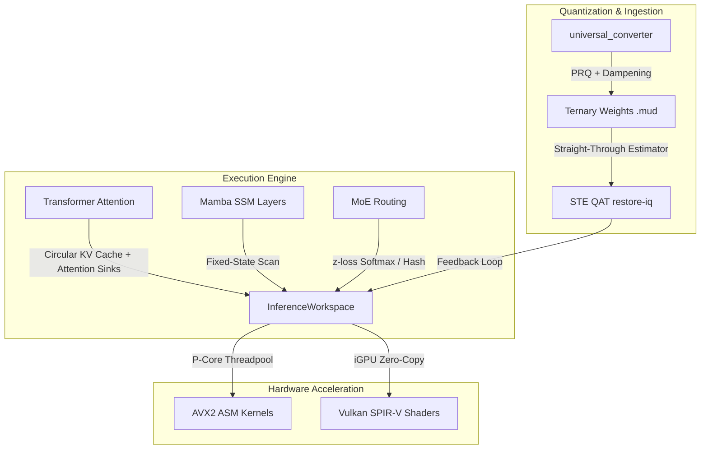

# 🧠 MUD Comprehensive Research & Feasibility Synthesis
**Context:** forge_llm (MUD) — 1.58-bit Ternary Hybrid Transformer+Mamba+MoE Engine  
**Date:** June 4, 2026  
**Reference Hardware:** Intel i7-1260P · 16 GB LPDDR5 · Intel Iris Xe iGPU  

---

## 🧭 Executive Summary
Forge LLM (MUD) occupies a unique niche in the AI ecosystem: it is currently the **only Rust-native engine** implementing a hybrid Transformer-Mamba-MoE architecture with straight-through estimator (STE) quantization-aware training (QAT), per-row quantization (PRQ), and AVX2/Vulkan-accelerated multiplication-free kernels. 

This document synthesizes findings from six parallel research investigations to establish our technical baseline, compare against contemporary Rust and C++ frameworks, and evaluate the feasibility of upcoming roadmap features.

---

## 📦 Domain Synthesis & Project Applicability

### Domain 1: 1.58-Bit Ternary Quantization & BitNet
* **Key Foundational Works:** *BitNet b1.58* (Microsoft, 2024), *BitNet 2B4T Technical Report* (Microsoft, 2025).
* **Code References Studied:** `tzervas/bitnet-quantize` (STE QAT on Candle), `ocentra/bitnet.rs` (WGPU).
* **Key Insights:**
  * **Straight-Through Estimator (STE) Correctness:** Rounding functions are non-diferentiable. STE bypasses this in backprop by setting $\frac{\partial L}{\partial x_{\text{float}}} \approx \frac{\partial L}{\partial x_{\text{quant}}}$. This validates our native `forge_autograd` shadow weight training loop.
  * **Per-Row Quantization (PRQ) Superiority:** While standard BitNet uses per-tensor absmean scaling, MUD's PRQ preserves per-neuron magnitude variances, which yields a higher SQNR $\ge 10.5$ dB.
  * **Semi-Structured Sparsity:** *Sparse-BitNet* (2026) shows that trained 1.58-bit models naturally have ~42% zero-weights. We can leverage this statistics in the AVX2 unpacker via a bitmask skip to bypass cold neurons.

### Domain 2: Mamba SSM & Hybrid Architectures
* **Key Foundational Works:** *Mamba* (Gu & Dao, 2023), *Mamba-2 / SSD* (Dao & Gu, 2024), *Mamba-3* (Lahoti et al., ICLR 2026 Oral).
* **Code References Studied:** `silvermpx/mamba-rs` (Mamba-3 SISO), `LaurentMazare/mamba.rs` (Pure Rust CPU scan).
* **Key Insights:**
  * **O(1) Context Scaling:** Mamba's dual-representation allows sequential steps in O(1) state updates, eliminating memory growth during generation.
  * **Mamba-3 Upgrades (ICLR 2026):** 
    1. *Exponential-Trapezoidal Discretization:* A 2nd-order approximation that improves numerical stability on ternary matrices.
    2. *MIMO (Multi-Input Multi-Output) Formulation:* Vectors instead of scalars increase AVX2 SIMD arithmetic intensity.
    3. *Complex-Valued States:* Captures oscillatory/positional dynamics naturally, serving as a parameter-free replacement for RoPE.
  * **State Space Duality (SSD):** Proves SSMs are mathematically equivalent to linear attention, validating the structural integrity of Jamba-like interleaving.

### Domain 3: Mixture of Experts (MoE) & Gating
* **Key Foundational Works:** *Mixtral of Experts* (Mistral AI, 2024), *ST-MoE* (Zoph et al., Google, 2022), *DeepSeekMoE* (DeepSeek AI, 2024).
* **Key Insights:**
  * **Router Stability via z-loss:** During QAT with STE, logits can diverge. Adding the router z-loss:
    $$L_z = \beta \cdot \left(\log \sum_{i} e^{z_i}\right)^2$$
    dampens logit magnitude, stabilizing softmax calculations. This is highly actionable for our trainer.
  * **Shared Experts:** DeepSeekMoE's concept of having dedicated shared experts captures common representation patterns, reducing entropy and variance in the routing layers.
  * **Hash/Zero-Parameter Routing:** *Hash Layers* (Meta, 2021) shows routing can be completely deterministic via key hash, eliminating router parameters and routing calculation allocations entirely.

### Domain 4: Recursive Reasoning & Test-Time Training
* **Key Foundational Works:** *Quiet-STaR* (Zelikman et al., 2024), *COCONUT* (arXiv:2412.06769), *TTT* (arXiv:2407.04620), *DeepSeek-R1* (2025).
* **Key Insights:**
  * **COCONUT Latent Reasoning:** Instead of emitting reasoning tokens, COCONUT re-feeds hidden states $K$ times through a subset of layers before generating the next token. This "thinking in latent space" requires zero extra memory and fits our `InferenceWorkspace` circular buffers.
  * **Test-Time Training (TTT) Layers:** Updating a small weights matrix during the forward pass yields linear attention behavior. However, it requires an on-the-fly gradient step during inference, which has high computational overhead (feasibility is limited to 1–2 layers).

### Domain 5: SIMD, Edge AI & Memory Management
* **Key Foundational Works:** *LLM in a Flash* (Apple, 2024), *PowerInfer* (SJTU, 2024), *Attention Sinks* (Xiao et al., 2023), *ALiBi* (Press et al., 2022).
* **Key Insights:**
  * **Row-Column Bundling:** Aligning weight reads from mmap storage to 32-byte chunks matches AVX2 `vmovdqa` limits perfectly.
  * **Attention Sinks:** The initial 4 tokens in attention collect the majority of softmax mass (sinks). Retaining the first 4 sink tokens in our circular KV cache prevents the break in semantic coherence at position 4000 without requiring extra memory.
  * **ALiBi Extrapolation:** Adding linear biases to attention logits allows context length extrapolation without positional embedding tables.

---

## 🛠️ The Rust AI/ML Ecosystem (MUD Position)

The Rust ecosystem is rich in ML tools, but MUD remains highly differentiated:

| Framework | Core Engine | Custom Quantization | Mamba/SSM | Vulkan Backend | Memory Model |
|---|---|---|---|---|---|
| **HuggingFace Candle** | Pure Rust tensors, CUDA/Metal/CPU | Native GGUF (Q4K, etc.) | CPU examples | ❌ No | Standard allocation |
| **mistral.rs** | Candle-based server, ISQ | ISQ, UQFF | ⚠️ Hybrid track | ❌ No | PagedAttention |
| **burn-rs** | General framework, WGPU/MLIR | 8/4/2-bit PTQ | ❌ No | ✅ WGPU | Dynamic execution |
| **oxillama** | Pure Rust model executor | ⚠️ ggml-quant | ✅ Jamba/Mamba-2 | ❌ No | Static KV cache |
| **mamba-rs** | Custom SSM executor | ❌ No | ✅ Mamba-3 SISO | ❌ No | Dynamic allocation |
| **MUD (Forge)** | Pure Rust + AVX2 ASM | **1.58-bit Ternary PRQ** | **✅ Jamba Hybrid** | **✅ Zero-Copy SPIR-V** | **Zero-Allocation Workspace** |

### Critical Code Reference Findings:
1. **`tzervas/bitnet-quantize`:** The only other public Rust implementation of STE ternary QAT. It is built on Candle and acts as a validation reference for our `forge_autograd` ternary gradient paths.
2. **`cool-japan/oxillama`:** The only other Rust engine that implements the Jamba block layout. It provides a clean reference for managing KV-caches in interleaved Transformer-Mamba setups.
3. **`5000user5000/mpGEMM`:** Implements mixed-precision INT4 x FP16 GEMM using AVX2 lookup tables (`_mm256_shuffle_epi8` / `vpshufb`). This is the state-of-the-art pattern for multiplication-free dot products, allowing us to unpack 16 ternary weights and apply signs using a single SIMD instruction.

---

## ⚙️ Feasibility Matrix & Actions

Below is the updated action plan ranked by **Impact vs. Effort** for our target hardware:

| Priority | ID | Feature | Implementation Details | Esfuerzo | Impacto | Factibilidad |
|---|---|---|---|---|---|---|
| **1** | `EDGE-03` | **z-loss router** | Add $L_z = \beta (\log \sum e^{z_i})^2$ to QAT loss in `src/mud/routing.rs` | 1 day | 🔴 High (QAT stability) | 🟢 Easy |
| **2** | `EDGE-01` | **Attention Sinks** | Retain first 4 tokens permanently in `InferenceWorkspace` KV-cache | 2 days | 🔴 High (Context coherence) | 🟢 Easy |
| **3** | `BIT-01` | **vpshufb LUT Kernel** | Port mpGEMM's `vpshufb` lookup pattern to AVX2 ASM for ternary GEMV | 7 days | 🔴 High (+50% TPS) | 🟡 Medium |
| **4** | `RRM-01` | **COCONUT loop** | Implement hidden state re-feed loop in `src/mud/inference.rs` | 5 days | 🟠 Medium (+Reasoning) | 🟢 Easy |
| **5** | `EDGE-05` | **BPE O(n log n)** | Add HuggingFace `tokenizers` crate to replace manual $O(n^2)$ lookup | 5 days | 🟠 Medium (Prompt speed) | 🟡 Medium |
| **6** | `MATH-03` | **Mamba-3 MIMO** | Refactor SSM scan to process vector-sized inputs in `src/mud/inference.rs` | 12 days | 🟠 Medium (+25% CPU speed) | 🟡 Medium |
| **7** | `ALIGN-02` | **TTT Layers** | Insert TTT fast-weight linear updates (limit to 1–2 layers max) | 20 days | 🟡 Low-Medium (Quality) | 🔴 Hard |

---

## 🚀 Recommended Model Path (The "Most Intelligent" Model)

Given our constraint of **8-16 GB RAM without dedicated GPU**, the optimal conversion targets for the `.mud` format are:

1. **Phi-4-mini (3.8B):**
   * *Params:* 3.8B (FP16 size ~7.6 GB; **MUD size ~480 MB**).
   * *Strengths:* Exceptional reasoning (GPQA-Diamond, math), outperforms many larger model architectures.
   * *MUD Role:* Target for Phase 14 recursive reasoning and COCONUT latent loops.
2. **Qwen3-4B:**
   * *Params:* 4B (FP16 size ~8 GB; **MUD size ~500 MB**).
   * *Strengths:* Native bilingual (ES/EN), generalist knowledge, strong coding capability.
   * *MUD Role:* General production assistant model.

Both models will fit comfortably within ~3 GB of active memory when converted to our packed 1.58-bit layout, leaving ample RAM for context caches and systems operation.
