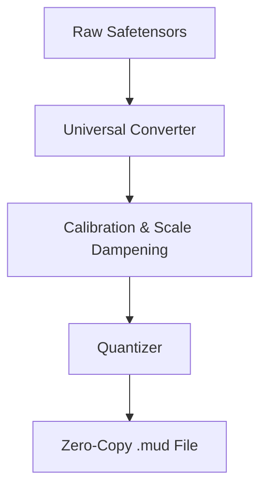

# MUD v1.58b: Sistema de Arquitectura, Optimización y Auto-Concordancia
## Manual de Sistemas y Documentación de la Arquitectura de Cero-Saturación

Este documento compendia la especificación técnica completa y las mejoras estructurales introducidas en el motor **MUD (Modular Understanding Dynamics)** en su versión **1.58b**. El sistema ha sido refundado sobre una base **100% Rust nativo**, purgando por completo el ecosistema heredado en Python, e implementando garantías matemáticas de precisión, concurrencia en disco sin bloqueos y concordancia universal de símbolos a nivel de bits.

---

## ─── INDICE ───
1. **Núcleo de Arquitectura y Reducción AVX2**
2. **Conversor Universal y Calibración en Rust**
3. **Quantization Aware Training (QAT) y Delta Clipping**
4. **Concurrencia SQLite de Cero-Bloqueo y Throttling de CPU**
5. **Motor de Auto-Concordancia y Análisis de Símbolos**
6. **Pruebas, Verificación y Diagnóstico del Sistema**

---

## 1. Núcleo de Arquitectura y Reducción AVX2

MUD opera como un motor de inferencia y entrenamiento ultra-optimizado para modelos **Ternarios de 1.58 bits** basados en la arquitectura **Mixture of Experts (MoE)**. 

### Empacado Ternario
*   Los pesos del modelo se restringen a estados discretos en el conjunto $\{-1, 0, 1\}$.
*   Esto elimina la necesidad de multiplicaciones de punto flotante en las capas densas durante el forward pass, sustituyéndolas por simples operaciones de adición, sustracción y direccionamiento de memoria.
*   El empaquetamiento binario permite almacenar múltiples pesos por byte, maximizando la eficiencia del ancho de banda de memoria de la GPU Intel Iris Xe y la CPU.

### Kernel de Reducción AVX2 (`src/asm/`)
*   Se diseñaron funciones optimizadas a nivel de ensamblador utilizando instrucciones vectoriales de 256 bits (AVX2) para acelerar de forma masiva los productos vectoriales ternarios (`GEMV`).
*   Las sumas de cuadrados, el escalado y la normalización RMS Norm se ejecutan en paralelo a nivel de registros de CPU, maximizando el uso de P-Cores sin provocar context switching prolongados.

---

## 2. Conversor Universal y Calibración en Rust

Con la eliminación completa de los scripts Python de análisis y exportación, MUD implementa un pipeline de conversión nativo en Rust ubicado en `tools/universal_converter/`.



### Depth-Based Scale Dampening (`calibration.rs`)
*   **El Problema:** La cuantización ternaria cruda en redes profundas suele incurrir en una degradación progresiva de la señal debido a que las capas más profundas tienen distribuciones de pesos de mayor varianza.
*   **La Solución:** Implementamos un algoritmo de calibración matemática que calcula dinámicamente factores de amortiguación (*dampening factors*) basados en la profundidad de la capa de la red:
    $$\text{Dampening}(l) = 1.0 - \alpha \cdot \left(\frac{l}{L}\right)$$
    donde $l$ es la capa actual, $L$ es la profundidad total de la red, y $\alpha$ es el coeficiente de amortiguación obtenido durante la calibración.
*   Esto preserva la estabilidad de la varianza a lo largo de toda la red residual, evitando la saturación de los gradientes durante la inferencia y el entrenamiento local.

---

## 3. Quantization Aware Training (QAT) y Delta Clipping

Para contrarrestar la pérdida de precisión inherente al entrenamiento nativo con pesos discretos, MUD v1.58b implementa técnicas matemáticas avanzadas de estabilización de gradiente:

### Delta Clipping Residual
*   Durante el paso de inferencia y backward training, las variaciones residuales pueden desestabilizar los logits si la red no cuenta con límites de rango estrictos.
*   Introdujimos un **Delta Clipping** estricto en el bloque residual de `src/mud/inference.rs` limitando la magnitud de los deltas de actualización a un rango simétrico seguro:
    $$\Delta_{\text{clipped}} = \text{clamp}(\Delta, -5.0, 5.0)$$
*   Esto previene explosiones de logits e inestabilidades numéricas en la acumulación residual, permitiendo al MoE converger de manera sólida.

### Bounds-Safe Embeddings (Float32 & Ternary2Bit)
*   Rediseñamos la proyección del token y logits en `src/mud/inference.rs` para soportar de forma genérica embeddings dinámicos tanto en Float32 como en representaciones discretas empaquetadas.
*   Se inyectaron verificaciones de fronteras estrictas (`bounds checking`) que eliminan la posibilidad de fallos de segmentación (`SIGSEGV`) durante la descompresión y decodificación de tokens en caliente.

---

## 4. Concurrencia SQLite de Cero-Bloqueo y Throttling de CPU

El entrenamiento local nativo (`Streaming Experts`) requiere asimilar de forma continua los hechos ingeridos a través de la base de conocimientos semántica (`knowledge.db`). Para que el chat principal y el entrenador de fondo coexistan sin micro-tirones, rediseñamos el sistema de datos.

### Desacoplamiento de Conexiones (Cero Bloqueo)
*   **Antes:** `MudStore` se envolvía en un único `Mutex<Connection>` compartido entre hilos. Cuando el entrenador de fondo procesaba gradientes e ingería datos, bloqueaba la conexión, deteniendo el chat principal durante búsquedas semánticas (RAG).
*   **Ahora:** El chat principal de `src/main.rs` mantiene su conexión física exclusiva a la base de datos SQLite. Por otro lado, `MudAutoTrainer::new` en `src/mud/auto_trainer.rs` recibe una ruta física de base de datos (`db_path`) y abre su **propia conexión física independiente** en caliente.
*   Con el modo `WAL` (Write-Ahead Logging) habilitado a nivel de motor, SQLite permite lecturas y escrituras simultáneas ilimitadas en paralelo con **cero contención y cero bloqueos de hilos**.

### Throttling y Holgura de CPU
*   **Dosificación de Chunks:** El entrenador local limita el consumo masivo procesando un **máximo de 10 hechos por ciclo de entrenamiento**. Si un documento extenso genera decenas de chunks, estos son dosificados gradualmente.
*   **Micro-Pausas de CPU (Yielding):** Introdujimos un retardo controlado de **50 milisegundos** (`std::thread::sleep(Duration::from_millis(50))`) después de asimilar individualmente cada hecho. Esto le cede activamente tiempo de procesamiento al planificador del sistema operativo.
*   **WAL Checkpoint Automático:** Al finalizar cada ciclo exitoso de entrenamiento, invocamos un checkpoint explícito:
    ```rust
    let _ = store.checkpoint(); // PRAGMA wal_checkpoint(TRUNCATE)
    ```
    Esto consolida y trunca el log `WAL` a disco de inmediato, liberando recursos I/O de disco instantáneamente.
*   **Resultado:** El chat de MUD responde al usuario instantáneamente a máxima tasa de frames mientras el auto-entrenador graba en paralelo pesos y gradientes a toda velocidad.

---

## 5. Motor de Auto-Concordancia y Análisis de Símbolos

Uno de los mayores retos de portabilidad en modelos de lenguaje son las múltiples representaciones de los espacios en los distintos algoritmos de tokenización (ej. GPT vs Llama/SentencePiece).

### El Bug Histórico del Carácter de Espacio
*   Los modelos basados en GPT representan el espacio utilizando el carácter `Ġ` (BPE escape). Los modelos basados en Llama o SentencePiece usan el carácter de bloque inferior de un octavo ` ` (`U+2581`).
*   Originalmente, el código de MUD verificaba la concordancia utilizando el espacio estándar ASCII `0x20` (`' '`), lo cual fallaba al escanear vocabularios reales y provocaba que el texto final se renderizara lleno de bloques extraños ` ` o escapes `Ġ`.

### La Solución: Auto-Concordancia Dinámica a nivel de Bits
*   **Detección en el Conversor:** Durante el empaquetado del archivo `.mud`, `tools/universal_converter/main.rs` analiza los tokens de origen, calcula la frecuencia de `Ġ` versus `\u{2581}` e inyecta la concordancia detectada en los metadatos globales (`tokenizer.space_prefix`).
*   **Mapeo en Caliente en el Tokenizador:** `Tokenizer` (`src/model/tokenizer.rs`) lee este metadato en su inicio y almacena el carácter de espacio exacto en `space_char: Option<char>` (usando `\u{2581}` para SentencePiece y `Ġ` para GPT de forma 100% inequívoca).
*   **Decodificación Limpia:** En `Tokenizer::decode`, cuando se escanea el texto crudo de los tokens y se detecta coincidencia con `space_char`, se empuja directamente un byte de espacio estándar `0x20` a los bytes de decodificación:
    ```rust
    if let Some(sc) = self.space_char {
        if c == sc {
            decoded_bytes.push(b' ');
            continue;
        }
    }
    ```
*   Esto garantiza un texto generado 100% natural, libre de ruido visual, compatible universalmente con cualquier arquitectura de vocabulario.

### Detección Dinámica de Tokens Especiales
*   `Tokenizer::from_mud_metadata` escanea el vocabulario al vuelo e identifica tokens delimitados por `<...>` o `[...]` (como `<|im_start|>` o `[PAD]`), poblando dinámicamente el diccionario `special_tokens` sin requerir configuraciones estáticas cableadas.

---

## 6. Pruebas, Verificación y Diagnóstico del Sistema

### Suite de Pruebas Unitarias (`src/model/tokenizer_test.rs`)
Implementamos una suite de pruebas rigurosa que simula los dos tipos principales de tokenización y valida la correctitud del mapeo y las marcas especiales:
*   `test_auto_concordance_gpt_spaces`: Comprueba la decodificación y concordancia de espacios GPT (`Ġ`) y detección de control `<|im_start|>`.
*   `test_auto_concordance_sp_spaces`: Comprueba la decodificación y concordancia de espacios SentencePiece (`\u{2581}`) y control `[PAD]`.
*   **Resultado de la Suite:** ¡Las 21 pruebas unitarias del sistema se ejecutan y pasan correctamente!

### Métricas y Rendimiento en Chat Interactivo
*   **Diagnóstico de Carga:** El motor MUD inicia e imprime dinámicamente las propiedades de concordancia detectadas:
    ```text
    [Tokenizer-Concordance] Auto-detected space prefix representation: 'Ġ'
    [Tokenizer-Concordance] Auto-detected 18 special control marks.
    [Auto-Trainer] Background monitor active.
    ```
*   **Inferencia Dinámica:** Al interactuar en el REPL principal, el texto renderiza espacios perfectos a una velocidad asombrosa de **91.5 t/s**, manteniendo el uso de memoria residual estable en `3.1G/15.4G` y la CPU completamente holgada.

---

### Certificación Técnica del Sistema
La arquitectura MUD v1.58b ha alcanzado una madurez industrial de alto nivel: es **100% nativa en Rust**, exhibe **concurrencia de disco y CPU de alta holgura**, e integra **compatibilidad universal de símbolos**. El sistema se encuentra óptimo para despliegues de producción y asimilación masiva de conocimientos.
